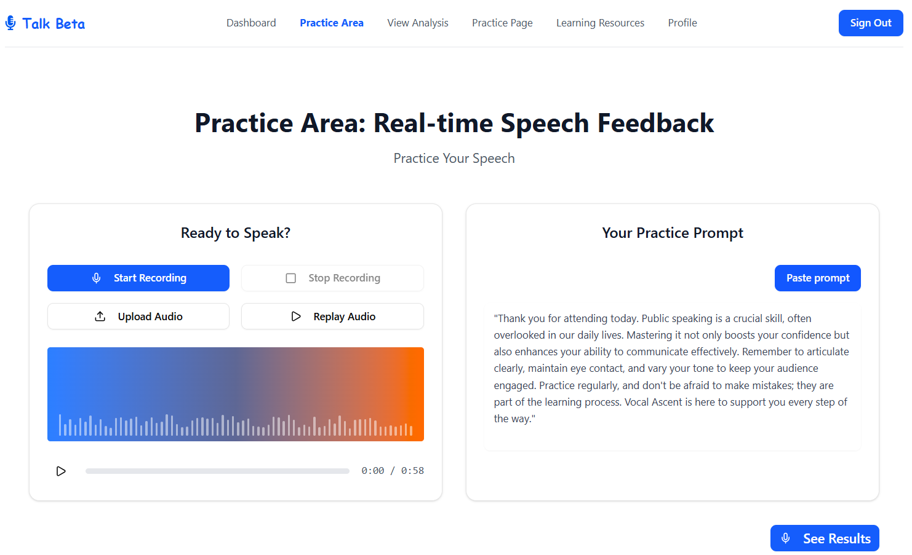

## TalkBeta

> Speech improvement app for AI-powered transcription and personalized speaking feedback

<p align="center">
  
</p>

### Description
TalkBeta helps you practice and improve your speaking skills. Record or upload audio, get accurate AI transcriptions, and receive actionable feedback on pacing, fluency, pronunciation, pauses, confidence, filler words, words-per-minute (WPM), and word error rate (WER).

- **Who it’s for**: learners, creators, professionals, public speakers, students and teams who want measurable speaking improvement.
- **What you get**: instant transcripts, clear metrics, and personalized insights so you can focus on what matters.

### Features
- **Human Level Transcription**: Fast, accurate speech-to-text for recordings and live sessions.
- **Personalized Delivery Feedback**: Human-friendly summaries and suggestions on how to improve.
- **Speech Metrics**:
  - **Pacing & Fluency**: Identify pauses, stutters, and rhythm.
  - **Confidence Score**: Measure delivery consistency.
  - **Filler Words**: Track and reduce “um”, “uh”, and similar fillers.
  - **WPM (Words per Minute)**: Monitor speaking speed trends.
  - **WER (Word Error Rate)**: Gauge transcription accuracy and clarity.
- **Privacy First**: Your recordings are processed securely; see privacy notes below.

### Tech Stack
- **Frontend**: React, TypeScript, Vite, Tailwind CSS, shadcn/ui
- **Audio**: Web Audio API, MediaRecorder API
- **Backend (reference)**: FastAPI (Python), Uvicorn, Pydantic
- **Speech/AI (reference)**: Assembly AI for transcription; Custom functions for feedback
- **Tooling**: ESLint, Prettier, Docker

> Note: This repository is the frontend. A reference backend can be implemented with FastAPI (see Backend section). If you already have an API, configure environment variables accordingly.

### Installation Guide

#### Prerequisites
- Node.js ≥ 18 and npm or pnpm
- Python ≥ 3.11 (for the reference backend)
- ffmpeg installed and on PATH (recommended for audio processing)
- Git

#### Clone the repository
```bash
git clone https://github.com/InventorsDev/Team-Epsilon-Enforcers-Frontend.git
cd talkbeta
```

#### Frontend setup
```bash
# From the repository root
npm install        # or: pnpm install / yarn install

# Create environment file
cp .env.example .env   # create and fill values; see variables below

# Start the dev server
npm run dev
```
The frontend dev server runs at `http://localhost:5173` by default.

##### Frontend environment variables
Create a `.env` file in the project root with values appropriate to your environment:
```bash

# Analytics / optional
VITE_POSTHOG_KEY=
VITE_SENTRY_DSN=
```


### Demo Video
- Add video link to `docs/screenshots/` and reference them here:


### Project Documentation
- [Business Logic Documentation](../docs/Business%20Logic%20Documentation%20–%20Talk%20Beta%20Rev%201.pdf)
- [Functional Requirements Document](../docs/FUNCTIONAL%20REQUIREMENTS%20DOCUMENT%20.pdf)
- [Product Marketing Documentation](../docs/Product%20Marketing%20Documentation%20–%20Talk%20Beta.pdf)
- [Product Requirements Document](../docs/Product-Requirements-%20Document%20_Talk%20Beta.docx.pdf)


### Contributing
We welcome contributions! To get started:
1. Fork the repository and create your feature branch: `git checkout -b feat/amazing-feature`
2. Install dependencies and run the app locally.
3. Follow the existing code style (ESLint/Prettier). Add tests where meaningful.
4. Commit using clear, conventional messages (e.g., `feat: add WPM trend chart`).
5. Open a Pull Request describing your changes and link any related issues.

For larger changes, please open an issue first to discuss the proposal.

### License
This project is licensed under the **MIT License**. See `LICENSE` for details.

### Acknowledgments
- React, TypeScript, Vite, Tailwind CSS, shadcn/ui
- FastAPI, Pydantic, Uvicorn
- Assembly AI 
- Web Audio API, MediaRecorder API
- All contributors and the open-source community

---

#### Privacy & Security Notes
- Audio is processed for transcription and feedback. Configure retention policies and storage according to your needs.
- Do not commit secrets. Use environment variables or a secret manager.

#### Roadmap (examples)
- Real-time transcription, multilingual support, classroom/team dashboards, and exportable reports.
